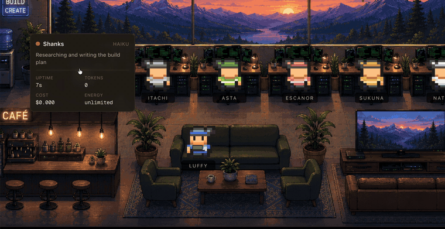

# Hackeroom

Hire a dev team. Run it on whatever agent you already have.

You create the members. Each one gets a name, a role you write in markdown,
skills you attach, an engine, a model, and a permission mode. They fill seats in
a workflow, work in real CLI sessions, share what they learn, and you watch the
whole thing happen in an office.

There is no built-in squad. The team is whoever you hire.



*Hovering a member shows what they are doing, how long the turn has run, and
what it has cost. There is also a [scripted walkthrough](https://singhabhinav04.github.io/SinghAbhinav04/hackeroom.html)
if you want the shape of a run without installing anything.*

---

## No Claude Code? No problem

Three engines, one team:

| | | |
|---|---|---|
| **Claude Code** | `claude` | Opus, Sonnet, Haiku, Fable |
| **OpenCode** | `opencode` | anything your providers reach — OpenRouter, Fireworks, OpenCode Zen |
| **Antigravity** | `agy` | Gemini 3.x, plus Claude and GPT-OSS through Google |

**And you can mix them in the same run.** Your planner can think on Opus while
your reviewer runs a free Gemini and your coder sits on whatever OpenRouter
model you feel like today. Pick the engine per member, from a dropdown, and the
model list follows.

**One gate. Three engines. Same rules.** Every one of them routes through the
same capability manifest — not three implementations that can drift, one set of
rules with three thin translators in front of it. A coder that cannot write
outside the project on Claude Code cannot write outside the project on
Antigravity either.

Every argument name in those translators was read off the running binary rather
than the docs, because all three name things differently — `file_path`,
`filePath`, `TargetFile` — and a wrong name means the gate reads an empty path,
which resolves inside the project, which it allows. That is a silent permit, not
a loud failure, so it is measured instead of assumed.

---

## What it actually does

**Members are yours.** Create `reacty` as a frontend coder on Haiku with
auto-accept, attach your UI guidelines as a skill, and give him a role prompt
you wrote. Create `pat` as a planner on Opus who only ever writes the plan.
Nothing is hardcoded — not the names, not the count, not the capabilities, not
the engine.

**Or describe the job and let it draft one.** Tell it what you are building and
you get a proposed team back — who is needed, which seat each one takes, what
model they run on, a role written for that job, and any skills worth attaching.
Nobody is created until you have read the proposal. The model is never asked
what anyone is permitted to do: capabilities come from the seat, and the schema
it answers has no field for them, so drafting a team cannot widen what the team
can reach. Switch on **Auto team creation** and the offer appears whenever the
roster cannot staff a run.

**Skills are per member.** On Claude Code, each member's skills are packaged as
a plugin loaded with `--plugin-dir` for that session only. Attaching a long
document to one member costs about fifteen tokens of context until they actually
need it, and nobody else can see it.

**They remember things.** Members run as separate sessions and cannot see each
other's conversations, so anything one learns dies with its turn unless it is
written down. Shared memory splits into a one-line-per-fact index and full
entries read on demand. What goes into a prompt is scored against the job — a
coder gets interfaces and gotchas, a reviewer gets decisions — and a resumed
turn is sent only what it has not already been told.

**You choose who runs.** A slot with nobody in it is skipped. Building a
frontend and don't want the tester? Switch the slot off and code review and
testing drop out of the run:

```
Phases: planning → coding → deploy
• No tester — code review and testing are skipped.
```

**Plans are documents, not chat spam.** A long answer collapses to a card
carrying its own heading and line count. Open it and the plan renders —
headings, tables, and ` ```mermaid ` fences drawn as actual diagrams, which is
rather the point of asking a planner for one.

**You can see the cost.** Tokens and spend are attributed per member and per
model. Where an engine reports tokens but no price, the gap says so rather than
showing a measured-looking `$0.00`.

**It stops rather than guesses.** A turn that returns no readable verdict fails
the run instead of counting as approval. Review loops that cannot converge pause
and name the disagreement rather than going round forever. A gate that cannot be
proved to refuse what it should means the run does not start at all.

---

## Getting started

```bash
pnpm install
npm run dev
```

Open <http://localhost:3000>, then **Manage Team** to hire someone. Or from the
terminal:

```bash
npm run team -- starter                      # one member per slot, to start from
npm run team -- add reacty --name Reacty --title Frontend \
                 --slot coder --model haiku --permission acceptEdits
npm run team -- skill reacty ui-docs ./ui-guidelines.md \
                 --desc "House style for buttons and spacing"
npm run team -- slot tester off              # skip the tester on the next run
npm run team -- list
```

Your team lives in `~/.hackeroom/` — `team.json`, plus a directory per member
holding their `role.md` and their skills.

### Requirements

- Node 22+ and pnpm
- At least one engine, logged in:
  - **Claude Code** 2.1.220 or newer
  - **OpenCode** — connect a provider in the UI, or `opencode auth login`
  - **Antigravity** (`agy`)
- Docker, only if you want the isolated runner (Claude Code only for now; it is
  not the default — see [SECURITY-ROADMAP.md](SECURITY-ROADMAP.md))

---

## The three views

**Office** (`/`) — the room. One desk per member, and you watch them work:
walking between desks to hand things over, wandering to the café or the sofas
when idle. Hover anyone for uptime, tokens, cost, energy and what they are
doing right now.

**Squad** (`/squad`) — the same run without the scenery. Supervisor-first chat,
direct tabs for each member, and a terminal pane showing the live tool calls
and their results.

**Team** (`/team`) — hire, fire, edit roles, attach skills, choose engines and
models, set permissions and budgets, switch slots on and off, and see what
everyone has spent.

---

## Slots

The workflow has six seats. A member takes one by being assigned to it.

| Slot | Does | Can write |
|---|---|---|
| `planner` | Researches and writes the build plan | `plan.md` only |
| `reviewer` | Pokes holes in the plan until there are none | nothing |
| `coder` | Builds exactly what the locked plan says | the project |
| `tester` | Reviews the code, then runs and tests it | nothing |
| `auditor` | Read-only OWASP-class pass over the result | nothing |
| `supervisor` | Your front door; explains and recovers the run | `~/Builds` |

Leave a seat empty and its phase is skipped. No planner means no run at all —
nothing would own the plan.

---

## How restrictions are enforced

Not by asking nicely in a prompt. Every tool call, on every engine, is gated
against a capability manifest the server writes at run start, and no member can
write to any engine's config directory — so none of them can edit their own
permissions.

Each engine has its own hook mechanism, so each gets a thin translator; the
rules themselves live in one place:

| Engine | Mechanism | Refuses by |
|---|---|---|
| Claude Code | `PreToolUse` hook | `exit 2` |
| Antigravity | `PreToolUse` hook | `{"decision":"deny"}` |
| OpenCode | `tool.execute.before` plugin | throwing |

Some clamps are unconditional and no configuration can unlock them: every
engine's config directory is unwritable, every member except the supervisor is
jailed to the project directory, sub-agent tools are blocked so nothing can
spawn helpers, Bash cannot mutate hooks or spawn another agent session, and any
tool not explicitly handled is denied.

Installing a gate is not the same as having one, so run start fires calls
through each gate that *must* be refused and one that must be allowed, and
checks both. A gate that cannot be proved refuses the run, with no override.

**69 contract tests** drive the real scripts against a temporary `$HOME`,
because a reimplementation of a security boundary tests nothing.

**It is a guardrail, not a sandbox.** Read [SECURITY.md](SECURITY.md) before
you point this at anything you care about.

---

## Where things live

```
src/lib/cli/       the engine adapters, decoders, tool vocabularies, gates
src/lib/team/      roster, slots, capabilities, memory, token accounting
src/app/api/       chat, run control, SSE state stream, team management
pipeline/          the orchestrator, the runner, the gate scripts
templates/roles/   starter roles offered when creating a member
scripts/           the test suite, the probes, and the team CLI
```

`ARCHITECTURE.md` has the full picture.

---

## Tests

```bash
npm test          # 21 suites
npm run typecheck
npm run lint
```

Plain node scripts with `node:assert` — no framework. Decoder and gate tests run
against streams captured from the real binaries (`scripts/fixtures/`), so they
need none of the three CLIs installed to pass.

The probes that captured them are checked in too:

```bash
node scripts/probe-antigravity.mjs    # spawns real turns; spends tokens
node scripts/probe-opencode.mjs
```

---

## Honest state of things

The Claude Code path is the one with the most mileage on it. The other two are
newer:

- OpenCode has been driven through a complete plan → code → test → audit build
  with every member on it — planner, reviewer, coder, tester and auditor — and
  the tool it produced passed its own 14 tests. Antigravity has not.
- Attached skills reach Claude Code and OpenCode members. Antigravity cannot
  load them at all: on `agy` 1.1.22 nothing under `.agents/` is discovered — not
  `skills/`, not the `skills.json` its own docs describe — and the only
  directory that does work is the user's global `~/.gemini/config/skills/`,
  which would collide with your own skills and outlive the run. A run that has
  attached skills it cannot deliver says so at the start rather than dropping
  them quietly.
- The Docker runner has no `agy` or `opencode` in its image, so an isolated
  member on either will fail at spawn rather than at run start.
- `ARCHITECTURE.md` keeps a list of the rest.

---

## Support the project

Hackeroom is free, noncommercial, and built in the open. If it saved you an
afternoon — or if you just like the idea of a pixel-art office where your agents
actually have to ask permission — you can throw a coffee my way:

**☕ [buymeacoffee.com/heysinghabb](https://buymeacoffee.com/heysinghabb)**

Stars, issues and pull requests are just as welcome, and free.

---

## Licence

[PolyForm Noncommercial 1.0.0](LICENSE). Use it, change it, share it, run it,
learn from it — freely. Selling it, or building it into something you sell,
needs permission.
